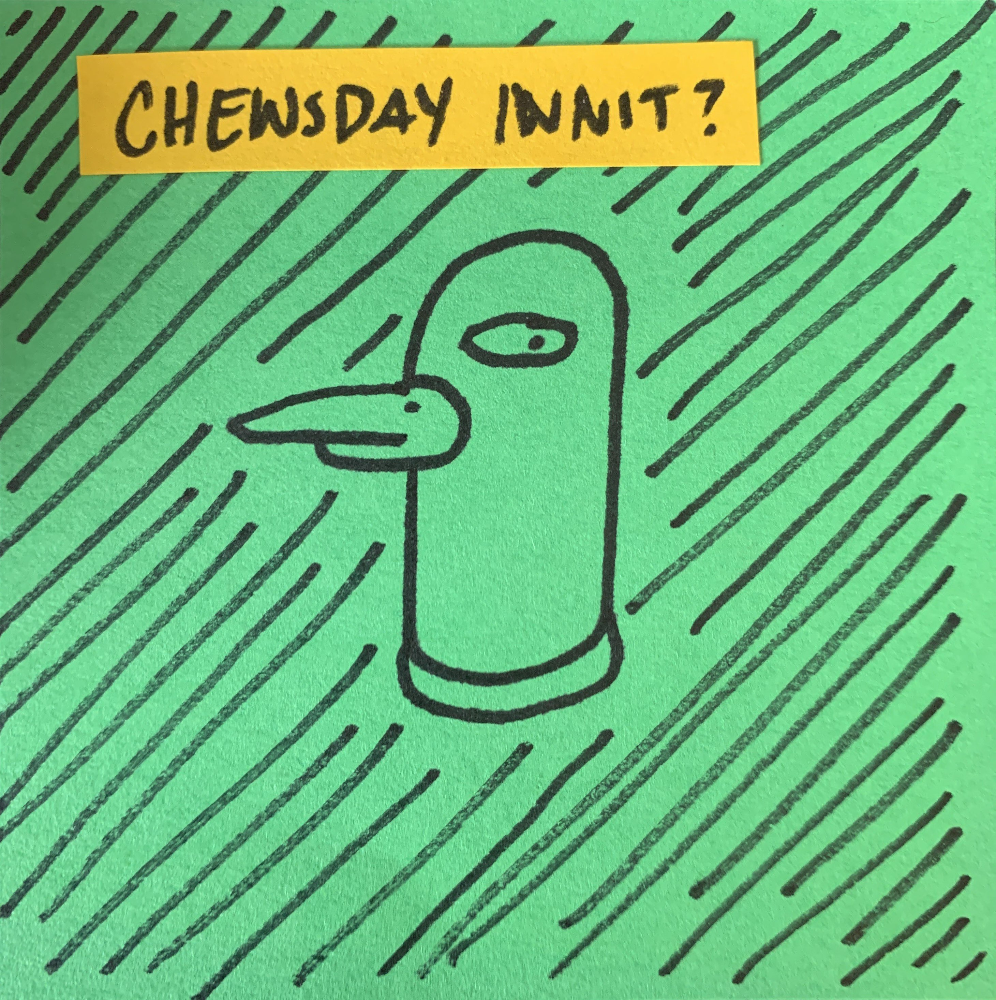
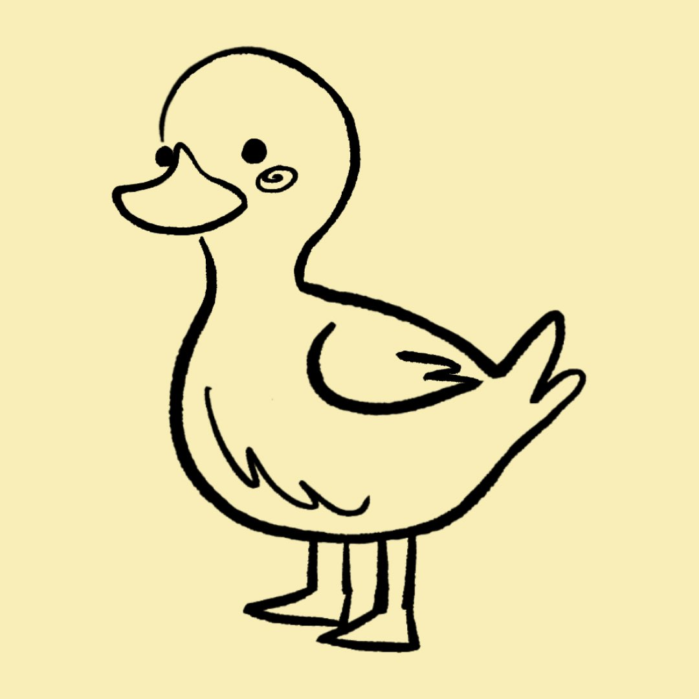

# Fresh Ducks: the Originals

Ducks are listed in order of contribution.

Description: *Ink drawing of a cartoon duck head on a sticky note. The duck looks suspiciously over its shoulder from below the caption "Chewsday innit?"*
Attribution: Anonymous contributor, 2022.
[Source](chewsday.jpg)

Description: *Cartoon with two panels. The cartoon is rendered in pencil, with realistic shading. Both panels depict a giant inflated duck that is 50 feet or 15 meters big. The duck is placed in the middle of a canal in front of a city skyline, with boats floating behind it. In the first panel, the duck is filled up, cute and smiling. The caption is '9 a.m'. In the second panel, the duck is deflated, its head half-way in the water and body crumpled up. It has eyebags and looks very tired. The caption is '5 p.m'*
Attribution: [Mars Lee](https://github.com/marsbarlee), 2022. Based on the [giant inflatable Rubber Duck that floated as much as it could in Hong Kong, 2013](https://en.wikipedia.org/wiki/Rubber_Duck_(sculpture)).
[Source](duck_day.png)

Description: *Drawing of a small, full body, round duck with blushy cheeks.*
Attribution: Aitana Martinez Huerta, 2022 ([Twitter](https://twitter.com/mars_please)) ([Instagram](https://www.instagram.com/mars.please/)).
[Source](pato-martinezhuerta.jpg)